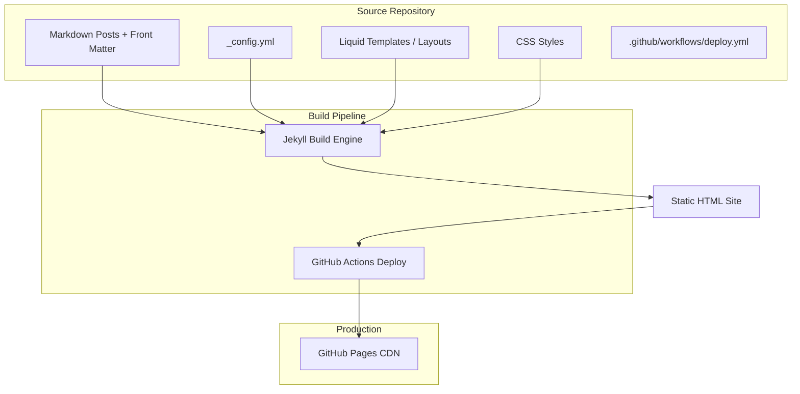
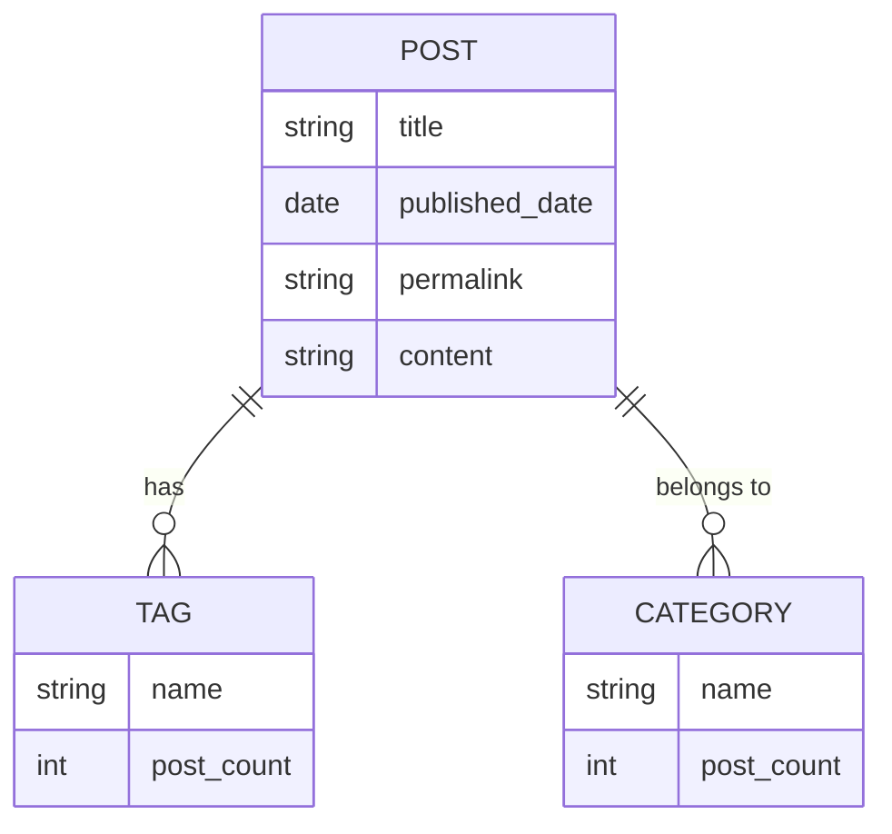

# Design Document: Mind Garden Personal Blog

## Overview

Mind Garden is a static personal blog built with Jekyll and deployed to GitHub Pages at `https://pmolina18.github.io/mind-garden`. The system transforms Markdown content with YAML front matter into a fully rendered static site organized by tags and categories, with a minimalist design focused on readability.

The architecture prioritizes simplicity: content lives in Markdown files, Jekyll handles static site generation, Liquid templates control layout and logic, and GitHub Actions automates build and deployment. No custom server-side code or JavaScript frameworks are required.

**Key Design Decisions:**
- **Jekyll as SSG**: Chosen for native GitHub Pages support, mature plugin ecosystem (jekyll-feed, jekyll-seo-tag), and Markdown-first authoring workflow.
- **Tag/Category dual taxonomy**: Tags provide fine-grained cross-topic discovery; categories provide high-level grouping. Both use Jekyll's built-in taxonomy support.
- **No JavaScript dependency**: All interactivity (navigation toggle on mobile) uses CSS-only or minimal vanilla JS to meet performance constraints.
- **GitHub Actions over legacy Pages deployment**: Provides more control over the build pipeline, supports custom plugins, and enables concurrency management.

## Architecture



### Directory Structure

```
mind-garden/
├── _config.yml                  # Site configuration
├── _posts/                      # Blog posts (YYYY-MM-DD-title.md)
├── _layouts/
│   ├── default.html             # Base layout (nav, head, footer)
│   └── post.html                # Single post layout
├── _includes/
│   ├── head.html                # <head> with meta, RSS autodiscovery
│   ├── navigation.html          # Site-wide navigation
│   └── footer.html              # Site footer
├── assets/
│   └── css/
│       └── style.css            # Minimalist stylesheet
├── index.md                     # Home page (10 most recent posts)
├── about.md                     # About page
├── tags.md                      # Tags listing page
├── categories.md                # Categories listing page
├── feed.xml                     # RSS/Atom feed (generated by jekyll-feed)
├── .github/
│   └── workflows/
│       └── deploy.yml           # GitHub Actions deployment workflow
└── README.md                    # Repository documentation
```

## Components and Interfaces

### 1. Configuration (`_config.yml`)

Central configuration defining site identity, URL structure, theme settings, and plugins.

```yaml
title: "Mind Garden"
description: "A personal blog for thoughts on diverse topics"
url: "https://pmolina18.github.io"
baseurl: "/mind-garden"
permalink: /:year/:month/:day/:title/

markdown: kramdown
kramdown:
  input: GFM

plugins:
  - jekyll-feed
  - jekyll-seo-tag

feed:
  posts_limit: 20

# Navigation links (used by navigation.html include)
navigation:
  - title: Home
    url: /
  - title: About
    url: /about/
  - title: Tags
    url: /tags/
  - title: Categories
    url: /categories/
```

### 2. Layouts

#### `default.html`
Base layout wrapping all pages. Includes:
- HTML5 doctype and `<head>` (charset, viewport, SEO tags, RSS autodiscovery)
- Navigation component
- Content area (`{{ content }}`)
- Footer

#### `post.html`
Extends `default.html` for individual posts. Adds:
- Post title as `<h1>`
- Publication date formatted as human-readable
- Tag list rendered as clickable links to `/tags/#tag-name`
- Category display (if present)
- Post content

### 3. Includes

#### `navigation.html`
Renders the site-wide navigation menu:
- Iterates over `site.navigation` from config
- Applies `active` class when `page.url` matches the link URL
- On mobile (< 768px): uses a CSS-based toggle or inline layout
- Contains RSS feed link/icon
- Keyboard accessible with visible focus indicators

#### `head.html`
Renders the `<head>` section:
- Meta charset, viewport
- `` tag (from jekyll-seo-tag)
- `` tag (from jekyll-feed, generates autodiscovery link)
- Stylesheet link

### 4. Pages

#### `index.md`
Home page displaying the 10 most recent posts:
```liquid
---
layout: default
title: Home
---


  - [{{ post.title }}]({{ post.url | relative_url }}) — {{ post.date | date: "%B %d, %Y" }}

```

#### `tags.md`
Lists all tags alphabetically with post counts and links to filtered views:
```liquid
---
layout: default
title: Tags
permalink: /tags/
---


  
  
  <h2 id="{{ tag_name | slugify }}">{{ tag_name }} ({{ posts.size }})</h2>
  <ul>
  
  
    <li><a href="{{ post.url | relative_url }}">{{ post.title }}</a> — {{ post.date | date: "%Y-%m-%d" }}</li>
  
  </ul>

```

#### `categories.md`
Same structure as `tags.md` but iterates over `site.categories`.

### 5. Stylesheet (`assets/css/style.css`)

Single CSS file implementing the minimalist theme:
- **Color palette**: Maximum 3 primary colors + neutrals (white, black, grey)
- **Typography**: System font stack (sans-serif), 16px+ base size, 1.5-1.6 line-height, max-width 70ch for content
- **Layout**: Flexbox-based, responsive from 320px to 1920px
- **No decorative elements** on content areas (no box-shadows, background patterns, or borders)
- **Touch targets**: Minimum 44×44px on mobile viewports
- **Contrast**: All text/background combinations meet WCAG 2.1 AA (≥ 4.5:1)

### 6. GitHub Actions Workflow (`.github/workflows/deploy.yml`)

```yaml
name: Deploy Mind Garden to GitHub Pages

on:
  push:
    branches: ["main"]

permissions:
  contents: read
  pages: write
  id-token: write

concurrency:
  group: "pages"
  cancel-in-progress: true

jobs:
  build:
    runs-on: ubuntu-latest
    steps:
      - name: Checkout
        uses: actions/checkout@v4
      - name: Setup Pages
        uses: actions/configure-pages@v5
      - name: Build with Jekyll
        uses: actions/jekyll-build-pages@v1
        with:
          source: ./
          destination: ./_site
      - name: Upload artifact
        uses: actions/upload-pages-artifact@v3

  deploy:
    environment:
      name: github-pages
      url: ${{ steps.deployment.outputs.page_url }}
    runs-on: ubuntu-latest
    needs: build
    steps:
      - name: Deploy to GitHub Pages
        id: deployment
        uses: actions/deploy-pages@v4
```

### 7. Front Matter Schema

Every post requires this front matter structure:

```yaml
---
layout: post
title: "Post Title"           # Required: string
date: 2024-01-15              # Required: YYYY-MM-DD (ISO 8601)
tags: [tag1, tag2]            # Required: YAML list, 1-10 items
categories: [category]        # Optional: YAML list
---
```

**Validation Rules:**
- `title`: Required, non-empty string
- `date`: Required, must match `YYYY-MM-DD` format
- `layout`: Required, must reference an existing layout
- `tags`: Required, YAML list with 1–10 items
- `categories`: Optional, YAML list

## Data Models

### Post

| Field        | Type         | Required | Constraints                          |
|-------------|-------------|----------|--------------------------------------|
| title       | String       | Yes      | Non-empty                            |
| date        | Date         | Yes      | ISO 8601 (YYYY-MM-DD)               |
| layout      | String       | Yes      | Must reference existing layout       |
| tags        | List[String] | Yes      | 1–10 items                           |
| categories  | List[String] | No       | 0+ items                             |
| content     | Markdown     | Yes      | GFM-compatible                       |

### Site Taxonomy



### Navigation Item

| Field | Type   | Description                    |
|-------|--------|--------------------------------|
| title | String | Display text for the link      |
| url   | String | Relative URL path              |

### Feed Entry (Atom)

| Field     | Type     | Description                      |
|-----------|----------|----------------------------------|
| title     | String   | Post title                       |
| link      | URL      | Permalink to full post           |
| published | DateTime | Publication date                 |
| content   | HTML     | Full or summary content          |
| author    | String   | Blog author name                 |

## Correctness Properties

*A property is a characteristic or behavior that should hold true across all valid executions of a system — essentially, a formal statement about what the system should do. Properties serve as the bridge between human-readable specifications and machine-verifiable correctness guarantees.*

### Property 1: Home page shows the 10 most recent posts in reverse chronological order

*For any* set of published posts, the home page listing SHALL contain at most 10 posts, and those posts SHALL be the 10 with the most recent dates, ordered from newest to oldest. If fewer than 10 posts exist, all posts SHALL be shown.

**Validates: Requirements 1.3**

### Property 2: Tag count validation

*For any* post front matter, the `tags` field SHALL accept a YAML list containing between 1 and 10 tag values (inclusive). A post with 0 tags or more than 10 tags SHALL be considered invalid.

**Validates: Requirements 2.4**

### Property 3: Required front matter exclusion

*For any* post file where one or more of the required front matter fields (`title`, `date`, `layout`) is absent, the build process SHALL exclude that post from the generated site output.

**Validates: Requirements 2.5**

### Property 4: Date format validation

*For any* string value in the `date` front matter field, the value SHALL be accepted if and only if it matches the ISO 8601 date format `YYYY-MM-DD` (four-digit year, two-digit month 01–12, two-digit day 01–31 valid for the given month).

**Validates: Requirements 2.6**

### Property 5: Taxonomy listing correctness

*For any* collection of posts with tags/categories, the Tags Page and Categories Page SHALL list each taxonomy term in alphabetical (case-insensitive) order, and the post count displayed next to each term SHALL equal the actual number of posts associated with that term.

**Validates: Requirements 3.1, 3.4**

### Property 6: Taxonomy filtered view correctness

*For any* taxonomy term (tag or category) and any collection of posts, the filtered view for that term SHALL display exactly the set of posts associated with that term, in reverse chronological order by publication date.

**Validates: Requirements 3.2, 3.5**

### Property 7: Post tag rendering

*For any* post with N tags (where 1 ≤ N ≤ 10), the rendered post page SHALL display all N tags as clickable links, and each link SHALL point to the corresponding tag's filtered view on the Tags Page.

**Validates: Requirements 3.3**

### Property 8: Empty taxonomy exclusion

*For any* tag or category that has zero associated posts in the current site build, that term SHALL NOT appear on the Tags Page or Categories Page respectively.

**Validates: Requirements 3.6**

### Property 9: Navigation presence invariant

*For any* rendered page or post in the site, the navigation component SHALL be present in the HTML output.

**Validates: Requirements 4.1**

### Property 10: Feed listing correctness

*For any* set of published posts, the Atom feed SHALL contain at most 20 entries, those entries SHALL be the 20 most recent posts by publication date, and they SHALL be ordered from newest to oldest.

**Validates: Requirements 8.2**

### Property 11: Autodiscovery link presence

*For any* rendered page or post in the site, the HTML `<head>` SHALL contain a `<link>` element with `rel="alternate"` and `type="application/atom+xml"` pointing to the feed URL.

**Validates: Requirements 8.4**

## Error Handling

### Build-Time Errors

| Error Condition | Handling Strategy |
|----------------|-------------------|
| Invalid post filename (not `YYYY-MM-DD-title.md`) | Jekyll silently excludes the file from build output |
| Missing required front matter fields | Post excluded from generated site |
| Invalid date format in front matter | Post excluded from generated site |
| Tag count outside 1–10 range | Build warning logged; post may render but flagged |
| Invalid layout reference | Jekyll build fails with error message |
| Malformed YAML in front matter | Jekyll build fails with parse error |
| Markdown syntax errors | Rendered as-is (Kramdown is permissive) |

### Deployment Errors

| Error Condition | Handling Strategy |
|----------------|-------------------|
| Jekyll build failure | GitHub Actions marks run as failed; deployment step skipped |
| Deployment step failure | Run marked as failed; previous version remains live |
| Concurrent deployments | `cancel-in-progress: true` cancels older runs |
| Pages not responding after deploy | Considered misconfiguration; operator must investigate |

### Runtime Behavior (Static Site)

Since the output is a static site, there are no runtime server errors. Potential issues:
- **404 for removed content**: Handled by GitHub Pages default 404 page (or custom `404.html` if added)
- **Broken internal links**: Prevented by using `relative_url` filter consistently
- **Missing assets**: Prevented by keeping all assets within the repository

## Testing Strategy

### Unit Tests (Example-Based)

Unit tests focus on verifiable structural and configuration correctness:

1. **Configuration validation**: Verify `_config.yml` contains required keys (`title`, `url`, `baseurl`, `plugins`, `permalink`)
2. **Workflow structure**: Verify `deploy.yml` has correct triggers, permissions, concurrency, and action references
3. **Navigation order**: Verify navigation template renders links in the fixed order: Home, About, Tags, Categories
4. **Active page indication**: Verify the correct navigation link receives the `active` class for each page
5. **RSS link presence**: Verify navigation includes RSS feed link
6. **Layout existence**: Verify `default.html` and `post.html` exist in `_layouts/`
7. **Touch target sizing**: Verify interactive elements meet 44×44px minimum on mobile

### Property-Based Tests

Property-based tests validate universal behaviors across generated inputs. Use a property-based testing library appropriate to the testing language (e.g., `fast-check` for JavaScript/TypeScript, `hypothesis` for Python, or custom Liquid template testing).

Each property test runs a minimum of 100 iterations.

**Applicable properties for PBT:**
- **Property 1**: Generate random post collections (varying sizes, dates), verify home page logic selects top 10 by date descending
- **Property 2**: Generate random tag lists (varying lengths 0–15), verify validation accepts 1–10 and rejects others
- **Property 3**: Generate post front matter with random field presence/absence, verify exclusion logic
- **Property 4**: Generate random date strings (valid ISO and invalid formats), verify acceptance/rejection
- **Property 5**: Generate random post collections with tags/categories, verify alphabetical listing and accurate counts
- **Property 6**: Generate post collections and pick a random tag/category, verify filtered results are exactly correct and sorted
- **Property 7**: Generate posts with random tag sets (1–10), verify all tags render as links
- **Property 8**: Generate post collections where some tags/categories have zero posts, verify exclusion
- **Property 10**: Generate large post collections (20+), verify feed contains exactly top 20 by date

**Test tagging format:**
```
// Feature: personal-blog, Property 1: Home page shows the 10 most recent posts in reverse chronological order
```

### Integration Tests

Integration tests verify the full Jekyll build pipeline:

1. **Build success**: A valid site structure builds without errors
2. **Post rendering**: A sample post with valid front matter renders to HTML with correct content
3. **GFM support**: Posts using GFM features (tables, fenced code, task lists) render correctly
4. **Feed validation**: Generated `feed.xml` is valid Atom 1.0 XML
5. **Accessibility audit**: Automated a11y scan (axe-core or similar) passes on representative pages
6. **Responsive behavior**: Navigation accessible at 320px, 768px, and 1920px viewports
7. **Page weight**: No page exceeds 500 KB on initial load
8. **Contrast ratio**: All text/background combinations meet WCAG 2.1 AA (≥ 4.5:1)

### Smoke Tests

Quick checks that the site is correctly configured:

1. `_config.yml` exists with `baseurl: /mind-garden` and `url: https://pmolina18.github.io`
2. `_posts/` directory exists
3. `_layouts/default.html` and `_layouts/post.html` exist
4. `.github/workflows/deploy.yml` exists with correct trigger and actions
5. `plugins` list includes `jekyll-feed` and `jekyll-seo-tag`
